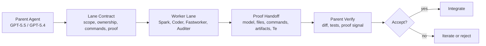

# 🏁 Fastlane for Codex


**Fastlane is the delegation control protocol for Codex.**

**Workers write. Parent decides. Proof ships.**

Your parent agent stops burning premium reasoning on mechanical edits. Bounded
worker lanes build the slice. Proof, not "tests passed", decides whether the
result ships.

Two skills. Zero hype. One operating rule: delegate construction, centralize
judgment.

Fastlane is for Codex users who want to move beyond single-agent execution: a
frontier parent model acting as technical manager, multiple worker lanes doing
bounded construction, more proof, and less avoidable rework.

> [!IMPORTANT]
> Green tests are not proof. If the new path did not leave evidence, it did not
> run.



## ⚡ What Every Lane Gets

- 🎯 Exact ownership.
- 🚧 Forbidden surfaces.
- 🧪 Causal proof requirements.
- 🧾 Handoff with files, commands, artifacts, proof fields, dirty state, and
  limitations.
- 🧠 Explicit model and effort choice.
- 🛑 Parent-side acceptance gate.
- 🕒 Optional `Te` measurements with TempoFastlane.

## 🧠 Why This Exists

High-reasoning Codex sessions are valuable. GPT-5.5 xhigh is strongest when it
acts like a technical manager: holding the human idea, architecture, tradeoffs,
integration, and acceptance criteria until the mission is done. The mistake is
spending that judgment on every mechanical edit, obvious test patch, and
bounded implementation slice.

Fastlane turns Codex into a technical manager for its own worker lanes:

- the parent defines the mission, ownership, constraints, and proof contract;
- the selected worker model executes a narrow lane with complete context;
- the parent reviews, hardens, integrates, and verifies before acceptance.

This matters because most agent delegation fails in two places:

- agents overestimate how long pure generation will take;
- agents accept "tests passed" even when the new path was never actually
  exercised.

Fastlane solves the proof problem with a strict delegation contract.
TempoFastlane solves the timing problem with TEMPONIZER: phase-aware
wall-clock calibration that treats measured runtime as truth.

In practice, the goal is not to make Codex reckless. The goal is to let Codex
create more lanes, earlier, with better evidence and less rework.

## ✍️ No Super Prompt Required

Fastlane also helps when you do not have the perfect "super prompt" ready.
Instead of asking the user to fully design the next implementation prompt, the
parent agent uses the protocol to inspect the repo, infer local conventions,
choose the next bounded useful lane, and turn that lane into an implementation
contract.

That claim comes directly from the skills: before spawning a worker, the parent
must inspect enough local context, capture a baseline, discover repo-native
commands, state the mission, assign ownership, define forbidden surfaces, and
set observable acceptance criteria.

Fastlane is not a roadmap oracle. If the task is still unclear, exploratory, or
impossible to isolate into a write scope, the protocol says not to delegate yet.
The promise is narrower and more useful: when the project has an implementable
next phase, Fastlane helps Codex materialize it as a lane with context,
ownership, and proof.

## 🔁 Before / After

| Before Fastlane | With Fastlane |
| --- | --- |
| Parent writes every mechanical edit. | Parent scopes the next bounded lane. |
| Worker handoff says "tests passed." | Handoff names files, commands, artifacts, proof fields, dirty state, and limitations. |
| Broad task scope can drift. | Owned files and forbidden surfaces constrain the lane. |
| False positives can survive green tests. | Parent accepts only after causal proof. |
| Premium reasoning gets spent on low-value construction. | Worker lanes materialize the slice while the parent keeps judgment. |

## 🏁 Skills

| Skill | Use it when | Core idea |
| --- | --- | --- |
| `fastlane` | You want a disciplined delegation workflow. | Delegate construction to a bounded worker lane; centralize judgment and final proof in the parent. |
| `tempofastlane` | You want the faster, calibrated lane. | Fastlane plus TEMPONIZER, which corrects inherited time estimates with measured execution time. |

## 🧭 Lane Router

Fastlane is no longer only "Spark or nothing." The system selects the smallest
capable worker for the contract:

- `spark`: `gpt-5.3-codex-spark` for near-instant compact iteration when
  available;
- `coder`: `gpt-5.3-codex` for bounded code-only implementation, debugging,
  tests, and focused refactors;
- `fastworker`: `gpt-5.4` low or `gpt-5.4-mini` medium for low-risk mechanical
  support work;
- `auditer`: `gpt-5.4` high or `gpt-5.5` high for review, proof gaps, and edge
  cases;
- `parent`: usually `gpt-5.5` or `gpt-5.4` at high/xhigh, reserved for
  synthesis, architecture, final proof, and integration judgment.

Every mode gets the same discipline: complete context, explicit ownership,
forbidden surfaces, repo-native commands, proof criteria, model/effort
rationale, and a required handoff. The difference is lane fit, task risk, and
expected parent rework, not prompt quality.

See [docs/model-matrix.md](docs/model-matrix.md) for the source-backed model
matrix and the parent cognitive budget rule.

## ⚙️ How The System Works

Fastlane is built around one operating rule:

> Delegate construction; centralize judgment and integration.

The parent agent does not disappear. It becomes more important. It decides what
should be delegated, chooses the lane model and reasoning effort, gives the
lane exact context, prevents scope drift, and rejects weak proof.

Each lane carries:

- a baseline snapshot of the repo state;
- owned files or modules;
- forbidden surfaces;
- exact repo-native verification commands;
- a proof contract that forces the new path to leave an observable signal;
- a model/effort rationale;
- a handoff that separates actual lane changes from pre-existing dirty files.

That is why Fastlane can make work feel faster without simply lowering the
quality bar. The system saves time by reducing wasted judgment and catching
false positives before they become parent-side rework.

## 🧪 Fastlane vs Normal Subagents

| Normal subagent | Fastlane |
| --- | --- |
| "Tests passed." | Names the exact proof artifact. |
| Broad task scope. | Explicit owned files and forbidden surfaces. |
| Vague summary. | Files, commands, proof fields, limitations, and dirty state. |
| Parent trusts the handoff. | Parent independently verifies. |
| Faster drift. | Proof-gated velocity. |

## 🧾 What A Valid Handoff Looks Like

```text
Lane: generated runtime smoke
Owned files:
- src/runtime/smoke.ts
- tests/runtime-smoke.test.ts

Commands:
- npm test -- runtime-smoke
- npm run smoke:runtime

Proof:
- artifacts/runtime-smoke.json
- runtime_smoke.source = "generated-fallback"
- fallback_generated = true

False-positive check:
- forced cache miss before smoke
- legacy path still passes

Dirty before worker:
- README.md

Te:
- GEN: 42s
- DBG: 2m12s
```

See [docs/proof-example.md](docs/proof-example.md) for the full illustrative
proof contract.

## 🚀 Install

Ask Codex to install the calibrated lane:

```text
Use $skill-installer to install https://github.com/maxkle1nz/codex-fastlane/tree/main/skills/tempofastlane
```

Ask Codex to install the baseline lane:

```text
Use $skill-installer to install https://github.com/maxkle1nz/codex-fastlane/tree/main/skills/fastlane
```

For repo-local use, copy or symlink the skill folder into your repository:

```bash
mkdir -p .agents/skills
cp -R skills/tempofastlane .agents/skills/
```

Restart Codex if the skill does not appear immediately.

## 🚦 Quick Start

Ask Codex:

```text
Use $tempofastlane for this bounded implementation. Keep the parent responsible
for architecture, final integration, and proof. Measure Te per phase if feasible.
```

Or use the simpler lane:

```text
Use $fastlane to delegate this bounded implementation slice to the right worker
lane. Keep ownership tight and require causal proof before acceptance.
```

## 🧭 What Makes It Different

Most agent repos teach what to know. Fastlane teaches how to delegate.

The failure mode of modern coding agents is not "cannot write code." It is
"accepts the wrong evidence too early."

Fastlane fixes the evidence. TempoFastlane fixes the clock.

TempoFastlane adds the deeper layer: temporal calibration.

Language models often inherit human planning priors from training data. They
describe work in human-scale blocks: minutes, hours, long sequential phases.
Agents do not always operate on that timeline. Some phases are seconds of
generation, batched I/O, or parallel setup.

TEMPONIZER makes the agent name that difference before deciding effort,
parallelism, or whether to iterate:

- classify the work phase as `GEN`, `IO`, `DBG`, or `PAR`;
- treat the inherited estimate as `Tp`, not truth;
- compute a corrected estimate `Tc = alpha(phi) * Tp`;
- measure real execution time as `Te`;
- update future delegation choices from the wall clock.

That is the TEMPONIZER loop: estimate, execute, measure, recalibrate.

The attitude change is the product: the agent stops waiting like a human
planner and starts creating lanes from measured execution reality.

The repo is designed to make those gains measurable. Use `Te` and proof
artifacts instead of asking users to trust a speed claim.

## 🛑 What Fastlane Is Not

- A prompt library.
- An "autonomous developer" pitch.
- A 10x productivity claim.
- A skill catalog.
- Production-ready by default. Proof is your job.
- A replacement for parent-side judgment.

It is a delegation protocol with measurable handoffs.

## 🧪 Proof Contract

A worker handoff is not accepted because it sounds confident. It is accepted
only when the parent can verify the causal signal.

Good proof answers:

- What proves the new code path ran?
- Which artifact contains it?
- Which field, log line, status, screenshot, or output confirms it?
- What could still be masking a false positive?
- Which files were already dirty before the worker started?

Velocity without proof is just faster drift.

## 🧩 Composes With m1nd And L1GHT

Fastlane becomes stronger when the parent has better structural context and
better operational knowledge.

- [`m1nd`](https://github.com/maxkle1nz/m1nd) helps the parent discover code
  structure, neighbors, impact, and risk before assigning a lane.
- [`L1GHT`](https://github.com/maxkle1nz/m1nd) keeps reusable operational
  knowledge and specs available to the parent before delegation.
- Fastlane turns that context into bounded execution with proof.

The combination is simple: discover better, delegate narrower, verify harder.

## 🗂️ Repo Structure

```text
.
+-- .codex-plugin/plugin.json
+-- skills/
|   +-- fastlane/
|   +-- tempofastlane/
+-- docs/
|   +-- launch-plan.md
|   +-- market-map.md
|   +-- model-matrix.md
|   +-- positioning.md
+-- examples/
+-- scripts/
```

## Market Position

Most agent-skill repositories are either catalogs, domain packs, or best
practice libraries. Fastlane enters a narrower and more ownable category:

> the delegation control protocol for Codex.

See [docs/market-map.md](docs/market-map.md) for the current landscape and
[docs/positioning.md](docs/positioning.md) for the product narrative.

## ✅ Validate

Run the repo-local validator:

```bash
python3 scripts/validate-skills.py
```

If you have Codex's skill creator installed locally, you can also run:

```bash
python3 ~/.codex/skills/.system/skill-creator/scripts/quick_validate.py skills/fastlane
python3 ~/.codex/skills/.system/skill-creator/scripts/quick_validate.py skills/tempofastlane
```

## 🔒 Trust Posture

- No telemetry.
- No secrets.
- No background services.
- No model lock-in beyond the current lane contracts described in the skills.
- Public claims must be backed by examples, case notes, or measured proof.

## Sources

- [OpenAI Codex skills documentation](https://developers.openai.com/codex/skills)
- [OpenAI Codex models documentation](https://developers.openai.com/codex/models)
- [OpenAI Codex subagents documentation](https://developers.openai.com/codex/concepts/subagents)
- [OpenAI GPT-5.5 release notes](https://openai.com/index/introducing-gpt-5-5/)
- [openai/skills](https://github.com/openai/skills)
- [Agent Skills standard](https://agentskills.io)
